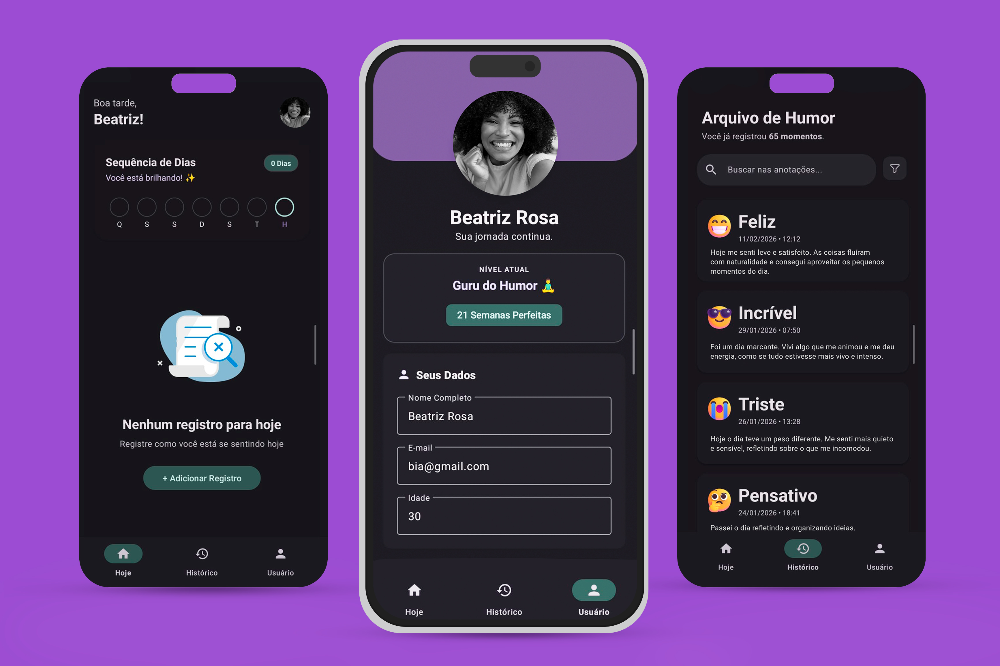
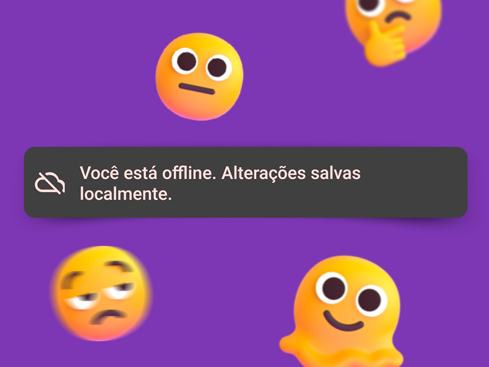
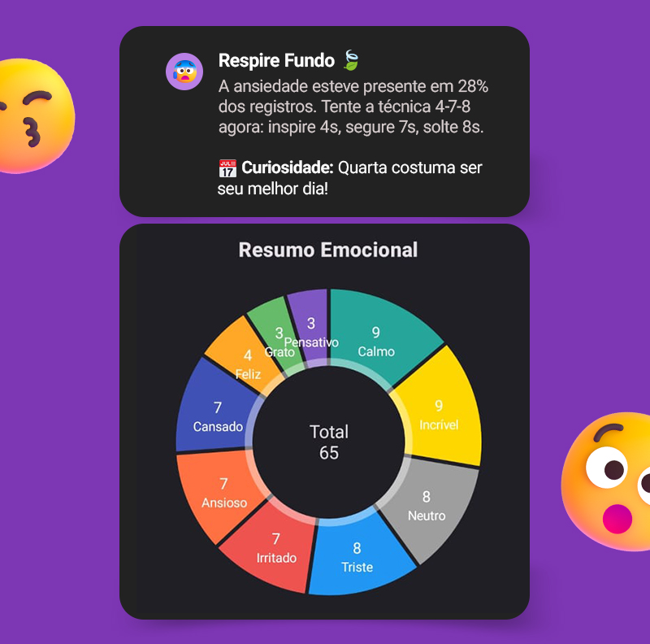
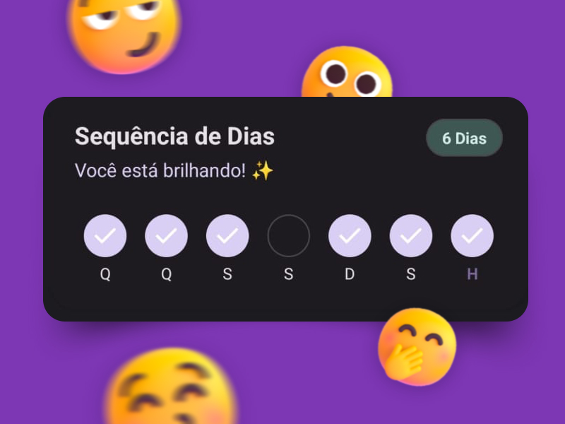

<h1 align="center">AppHumor </h1>

<p align="center">
  <strong>Seu diário emocional inteligente, resiliente e offline-first.</strong>
</p>

<p align="center">
  <a href="https://opensource.org/licenses/Apache-2.0"></a>
  <a href="https://android-arsenal.com/api?level=24"></a>
  <a href="https://kotlinlang.org/docs/reference/"></a>
  <a href="https://firebase.google.com/"></a>
   <a href="#"></a>
</p>

<p align="center">  
   Um rastreador de humor moderno desenvolvido em <strong>Kotlin</strong>, focado em ajudar usuários a identificar padrões emocionais através de gráficos e insights inteligentes. Construído com arquitetura <strong>MVVM</strong> e capacidade de funcionamento <strong>100% offline</strong>.
</p>

<p align="center">

</p>

## 🌟 Funcionalidades Principais

<table>
  <tr>
    <td width="60%">
      <h3>🔄 Sincronização Resiliente (Offline-First)</h3>
      <p>
        Não deixe a falta de internet parar seu diário. O AppHumor salva dados localmente e sincroniza silenciosamente com o <strong>Firebase Realtime Database</strong> assim que a conexão retorna.
      </p>
      <p>
        <em>Tech: Repository Pattern + Flags de Sincronização</em>
      </p>
    </td>
    <td width="40%">
        </td>
  </tr>
  <tr>
    <td width="60%">
      <h3>📊 Insights & Autoconhecimento</h3>
      <p>
        Algoritmos locais analisam seus registros para identificar padrões. Descubra seu "Melhor Dia da Semana" e "Humor Predominante" com gráficos interativos.
      </p>
      <p>
        <em>Tech: MPAndroidChart + Algoritmos de Análise Customizados</em>
      </p>
    </td>
    <td width="40%">
      
    </td>
  </tr>
  <tr>
    <td width="60%">
      <h3>🔥 Gamificação & Hábito (Streak)</h3>
      <p>
        Mantenha a constância! O app rastreia seus dias consecutivos e celebra pequenas vitórias com animações de confete para reforçar o hábito positivo.
      </p>
      <p>
        <em>Tech: Lottie Animations + Lógica de Calendário</em>
      </p>
    </td>
    <td width="40%">
      
    </td>
  </tr>
  <tr>
    <td width="60%">
      <h3>🔔 Lembretes Inteligentes</h3>
      <p>
        Nunca esqueça de se registrar. Sistema de agendamento local que respeita a bateria do dispositivo e funciona mesmo se o app for fechado.
      </p>
      <p>
        <em>Tech: WorkManager + Permissões Android 13+</em>
      </p>
    </td>
    <td width="40%">
      
    </td>
  </tr>
</table>


---

## 🛠️ Stack Tecnológica

Para construir um app resiliente e moderno, utilizei as ferramentas padrão da indústria:

* **Linguagem:** [Kotlin](https://kotlinlang.org/) (v2.0+) com foco em sintaxe expressiva e segurança de tipos.
* **Arquitetura:** **MVVM (Model-View-ViewModel)** com o padrão **Repository**, garantindo separação de responsabilidades.
* **Componentes Reativos:** **Coroutines & Flow** (especialmente `callbackFlow`) para lidar com fluxos de dados do Firebase de forma assíncrona.
* **Banco de Dados & Auth:** **Firebase** (Realtime Database & Authentication) com persistência local habilitada para suporte offline.
* **Processamento em Background:** **WorkManager** para garantir que os lembretes diários sejam entregues mesmo se o app for fechado.
* **UI/UX:** **Material Design 3**, **ViewBinding** (para evitar `findViewById`), **Coil** (carregamento de imagens) e **Lottie** (animações interativas).
* **Qualidade:** **Testes Unitários** com **JUnit 4**, **MockK** (para mocking de dependências) e **Coroutines Test**.
* **Segurança & Build:** **Version Catalog (TOML)** para gestão centralizada de bibliotecas e **ProGuard/R8** para ofuscação e otimização do APK.

---


### 📐 Diagrama de Fluxo de Dados

```mermaid
flowchart TD
    %% --- Definição de Cores (Material Design) ---
    classDef ui fill:#2196F3,stroke:#fff,stroke-width:2px,color:#fff;
    classDef vm fill:#FFC107,stroke:#fff,stroke-width:2px,color:#000;
    classDef repo fill:#4CAF50,stroke:#fff,stroke-width:2px,color:#fff;
    classDef cloud fill:#673AB7,stroke:#fff,stroke-width:2px,color:#fff,stroke-dasharray: 5 5;

    %% --- Blocos (Nós) ---
    UI["📱 Camada de UI<br/>(Activity, Fragments & XML)"]:::ui
    VM["🧠 Camada de Apresentação<br/>(ViewModel & LiveData)"]:::vm
    Repo["💾 Camada de Dados<br/>(HumorRepository & Sync)"]:::repo
    Cloud["☁️ Fontes Externas<br/>(Firebase & WorkManager)"]:::cloud

    %% --- Conexões ---
    UI -->|"1. Ação do Usuário"| VM
    VM -->|"2. Observa Estado"| UI
    
    VM -->|"3. Solicita Dados"| Repo
    Repo -->|"4. Retorna Dados"| VM
    
    Repo <-->|"5. Sincroniza (Auto)"| Cloud
  ```
### 📂 Estrutura de Pacotes

O projeto está modularizado por camadas funcionais para facilitar a escalabilidade:

```text
com.example.apphumor
├── 📂 di/                # Injeção de Dependência Manual (DependencyProvider)
├── 📂 models/            # Data Classes e Modelos de Domínio
├── 📂 repository/        # Single Source of Truth (Lógica Offline + Firebase)
├── 📂 ui/                # Camada de Visualização (Activities, Fragments, Adapters)
├── 📂 utils/             # Extension Functions e Lógica de Negócio Pura
├── 📂 viewmodel/         # Gerenciamento de Estado (StateFlow/LiveData)
└── 📂 worker/            # Tarefas em Background (WorkManager)
 ```


<br>

## 🧠 Insight Engine (Lógica de Negócio)

Diferente de apps que apenas armazenam dados, o AppHumor possui uma camada de inteligência local (`InsightAnalysis.kt`) que processa o histórico do usuário para gerar valor real.

**Como o algoritmo trabalha:**

* 🌊 **Detecção de Ondas:** Identifica se o usuário está em uma "maré" de ansiedade ou alegria nos últimos 30 dias.
* 📅 **Padrões Temporais:** Cruza dados para descobrir o "Melhor Dia da Semana" do usuário.
* 💡 **Feedback Ativo:** Se detectar padrões negativos (ex: 3 dias de "Sad"), sugere ações práticas de autocuidado.

<details>
  <summary><strong>🔍 Clique para ver a implementação do Algoritmo</strong></summary>
  <br>

```kotlin
// Trecho de InsightAnalysis.kt: Lógica de decisão baseada em frequência
fun generateInsight(notes: List<HumorNote>): InsightResult {
    // 1. Agrupa humores e conta a frequência
    val moodCounts = notes.groupingBy { it.humor }.eachCount()
    val dominantMood = moodCounts.maxByOrNull { it.value }?.key

    // 2. Aplica estratégia de feedback (Strategy Pattern)
    return when (dominantMood) {
        HumorType.ANXIOUS -> InsightResult(
            title = "Respire Fundo 🍃",
            message = "Detectamos ansiedade recente. Que tal a técnica 4-7-8?"
        )
        HumorType.HAPPY -> InsightResult(
            title = "Ótima Fase! ⭐",
            message = "Aproveite essa onda de energia para tirar planos do papel."
        )
        else -> InsightResult.Default()
    }
}
```
</details>


## 💡 Decisões de Arquitetura & Trade-offs

Este projeto foi desenhado simulando um ambiente de MVP (Produto Mínimo Viável), onde o custo e a velocidade de implementação são prioritários.

### 🖼️ Estratégia de Imagens (Base64 vs Storage)
Para manter a infraestrutura 100% gratuita e acessível (sem necessidade de cadastro de cartão de crédito no plano Blaze do Firebase), optou-se por armazenar as fotos de perfil como **Strings Base64** diretamente no Realtime Database.

**Como mitigamos problemas de performance?**
Sabendo que Base64 pode inflar o banco de dados, implementei um pipeline rigoroso de compressão em `ImageUtils.kt`:
1.  **Downsampling:** Redimensionamento forçado para no máximo **400px** (largura ou altura).
2.  **Compressão:** Qualidade JPEG reduzida para **70%**.
3.  **Resultado:** Avatares que pesariam 2MB+ são armazenados com **menos de 50KB**, garantindo carregamento rápido mesmo em redes móveis e sem travar a UI.


## 🚀 Instalação e Teste

Você tem duas opções para testar o AppHumor:

### 📱 Opção 1: Testar o APK (Recomendado)
Baixe a versão mais recente compilada e instale diretamente no seu dispositivo Android. Não requer configuração.

<a href="https://github.com/VirtroidDidi/app-humor-android/releases/download/v1.0.0/app-release.apk">
  
</a>

---

### 💻 Opção 2: Compilar do Código Fonte
<details>
  <summary><strong>Clique para expandir o guia de configuração (Requer Firebase)</strong></summary>

  <br>
  Como este projeto utiliza serviços em nuvem (Firebase Auth e Realtime Database), você precisará configurar seu próprio ambiente para compilar o código:

**Pré-requisitos:**
* Android Studio Iguana ou superior.
* JDK 17.

**Passo a Passo:**
1. **Clone o repositório:**
   ```bash
   git clone [https://github.com/VirtroidDidi/app-humor-android](https://github.com/VirtroidDidi/app-humor-android)
   ```
2. **Crie um projeto no [Console do Firebase](https://console.firebase.google.com/).**
3. **Ative os produtos:**
    * **Authentication:** Método Email/Senha.
    * **Realtime Database:** Crie no modo de teste.
4. **Adicione o arquivo de configuração:**
    * Baixe o `google-services.json` do console.
    * Cole na pasta: `app/google-services.json`.
5. **Compile e Rode:** Shift + F10 no Android Studio.
</details>


_____________

## 🌱 Bastidores: O que aprendi construindo este app

O AppHumor foi muito mais do que um exercício de código; foi onde eu realmente entendi como resolver problemas reais de desenvolvimento. Minha caminhada com ele foi assim:

* **O Desafio de Começar Organizado:** No início, o maior desafio foi entender como separar as coisas. Aprendi a usar a arquitetura **MVVM** para que a tela do app não ficasse "pesada" com lógica de banco de dados, deixando tudo mais limpo.
* **A "Mágica" do Offline:** Uma das minhas maiores descobertas foi o suporte offline. Eu queria que o usuário pudesse registrar seu humor mesmo no metrô ou sem sinal. Aprender a configurar o cache do Firebase e o `SharedPreferences` para o perfil foi um processo de muita leitura e testes.
* **Cuidando dos Detalhes:** Aprendi que um bom app precisa ser amigável. Gastei um bom tempo entendendo como implementar **notificações agendadas** e como usar o **Lottie** para que a interface tivesse vida e não fosse apenas um formulário sem graça.
* **Segurança e Entrega:** Pela primeira vez, lidei com a parte "final" do software: proteger o código com ProGuard e gerar um **APK assinado**. Entendi que o trabalho do desenvolvedor só acaba quando o app está pronto e seguro para ser instalado por qualquer pessoa.
* **Melhoria Contínua:** No meio do caminho, percebi que muitas coisas podiam ser melhores. Refatorei códigos, centralizei constantes e aprendi a usar o **Version Catalog** para organizar as bibliotecas. Foi um exercício de paciência e cuidado com a qualidade do que estou entregando.


<p align="center">
  Feito com ❤️ e Kotlin.
</p>


